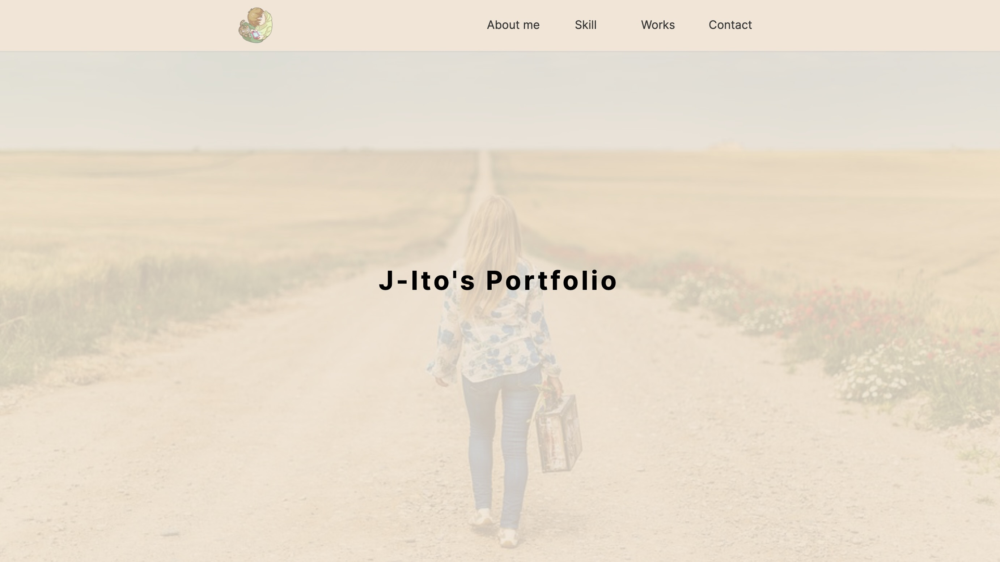

## The-View

   

## URL

https://j-ito-portfolio.vercel.app/

## 概要

J-Ito のポートフォリオです。 
プロフィール、習得スキル、連絡フォーム、これまでに制作したアプリを掲載しています。

## サービスへの想い

閲覧者にとって「見やすく、伝わりやすい」ことを第一に、シンプルなデザインを追求しました。 
Next.js の SSG（静的サイト生成）を活用し、高速なページ表示を実現しています。 
また、コードの可読性を重視し、共通化を利用した徹底したリファクタリングを行いました。

## 使用技術

- フロントエンド React 18 Next.js 14.2.3 TypeScript 5
- スタイリング Tailwind CSS 3.4.1 shadcn/ui
- アニメーション gsap 3.12.5
- デプロイ vercel
